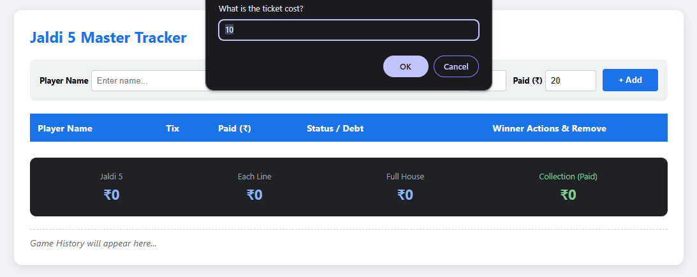
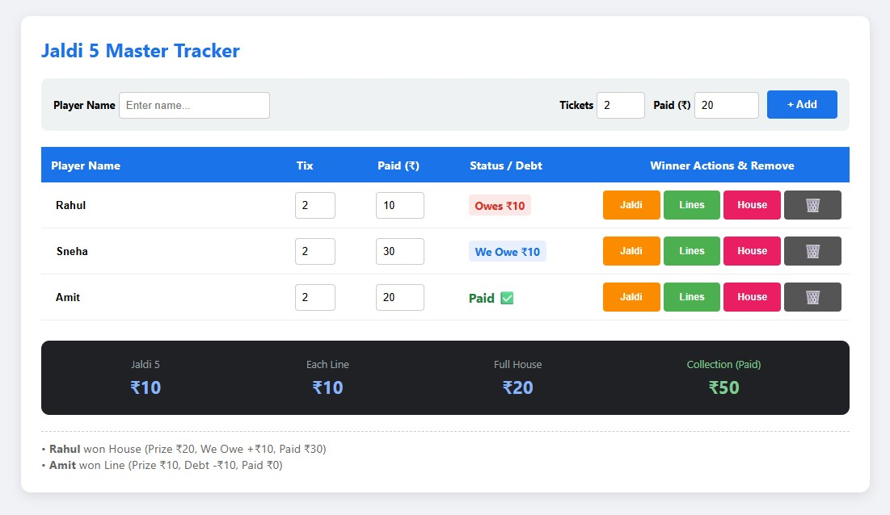

# 🎰 Jaldi 5 Master Tracker

> **The Ultimate Payout & Debt Management Engine for Game Organizers.** 
> No more mental math. No more "who owes what." Just smooth gaming.

[🚀 **LAUNCH LIVE APP**](https://sgnancharan.github.io/jaldi-5/)

---

## ⚡ The Problem vs. The Solution

**The Problem:** Mid-game, a player takes another ticket without paying cash. Someone else gives a ₹20 note for a ₹10 ticket. You lose track, the prize pool gets messy, and winners get paid the wrong amounts.

**The Solution:** This tracker features a **Dual-Debt Engine**. It tracks every player by name, monitors their "Paid vs. Due" balance in real-time, and automatically settles their account the moment they hit a prize.

---

## 🔥 Key Features

*   **🛠️ Live Two-Way Debt Tracking:** 
    *   **Red Status (Owes):** Automatically deducts unpaid ticket costs from winnings.
    *   **Blue Status (We Owe):** Automatically adds extra change back to the player's prize.
*   **📈 Dynamic Prize Scaling:** Prize amounts (Jaldi 20%, Lines 10% each, House 50%) recalculate instantly every time you add a player or adjust a payment.
*   **📝 Winner Audit Log:** A running history of every win, showing the original prize, the debt adjustment, and the final cash handed over.
*   **📱 Mobile-First Design:** Large buttons and editable table cells designed for fast finger-tapping during high-speed games.
*   **🗑️ Instant Management:** Rename players, adjust ticket counts, or remove players who drop out with one click.

---

## 📸 Interface Preview

### 1. Setup & Entry

*Easily define ticket costs and add players with custom payment amounts.*

### 2. Live Debt & Winner Tracking

*Manage winners and real-time debt status. Notice the color-coded debt tracking (Red for Owed, Blue for Change).*

---

## 🛠️ Installation & Deployment

This project is a **Zero-Dependency Vanilla JS** application. To host it yourself:

1.  **Fork** this repository.
2.  **Upload** your `index.html`.
3.  Go to **Settings > Pages** and enable GitHub Pages on the `main` branch.
4.  **Done!** Your tracker is live at `https://github.io`.

---

## 🕹️ Pro-Tips for Organizers

*   **The "Next Game" Cut:** If someone wants to "cut from the next game," just set their "Paid" to ₹0. The system will carry that debt until they win or you remove them.
*   **Home Screen App:** Open the live link on your phone and select **"Add to Home Screen"**. It will function like a native app without the browser address bar cluttering your view.
*   **Settling Accounts:** When a winner is marked, their debt is cleared in the system automatically, assuming you've handed them the "Net Payout" shown in the alert.

---

## 📝 License
Distributed under the MIT License. See `LICENSE` for more information.

---

**Built for the community. May your house always be full! 🏠✨**
